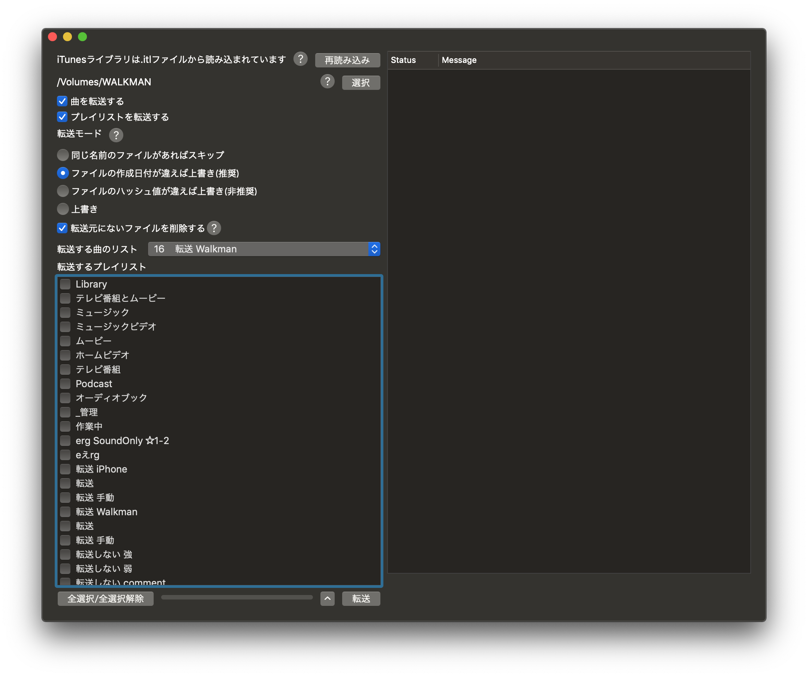

# SyncWalkman
This is an intelligent app for synchronizing Walkman.

You can transfer tracks and playlists to walkman from iTunes graphically.

This is beta (again. sorry.)  
Japanese language main.

language: swift 5, Xcode 10.2  
動作確認済Walkman: NW-A47

Requires: 

- /bin/rm
- /usr/bin/shasum
- /usr/bin/ditto
- /usr/local/bin/nkf
    - you can install with brew.
- ☑ Keep iTunes Media folder organized
<!--
- ☑ Share iTunes Library XML with other applications
-->

Recommends:

- ☑ Copy files to iTunes Media folder when adding to library

# How to use (gui version)
1. Select walkman root directory from picker. "選択" button.
1. Select the list (playlist) of songs to be sent from the pull-down to the right of "転送する曲のリスト".
1. Select playlists to be sent from the table below "転送するプレイリスト".
1. Push "転送" button to start send.

The log is displayed on the right.

